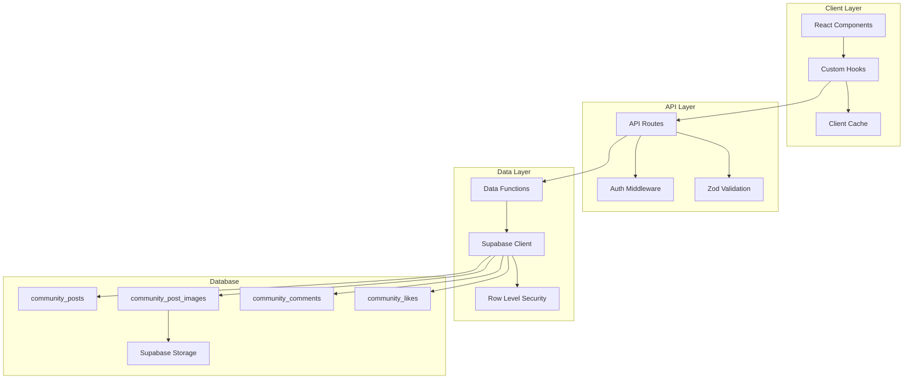
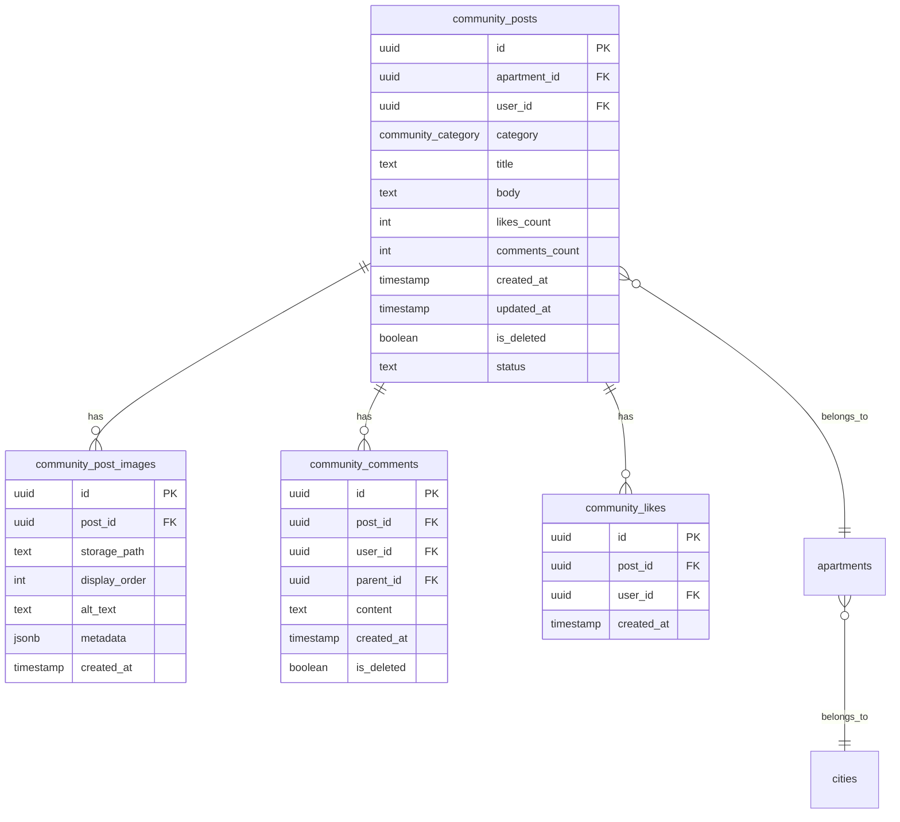

# Design Document

## Overview

This design document outlines the architecture for advanced community features that will transform VinaHome into a sophisticated, Daangn.com-inspired platform. The design focuses on scalable data architecture, optimistic UI patterns, infinite scrolling, and advanced user experience features while maintaining the existing Korean localization and apartment-centric approach.

## Architecture

### High-Level Architecture



### Database Schema Evolution

The current schema will be enhanced with a separate images table and optimized indexes for performance:



## Components and Interfaces

### Core Data Interfaces

```typescript
// Enhanced Post interface with image management
interface Post {
  id: string;
  apartment_id: string;
  user_id: string;
  category: CommunityCategory;
  title?: string;
  body: string;
  images: PostImage[];
  likes_count: number;
  comments_count: number;
  created_at: string;
  updated_at: string;
  status: 'draft' | 'published' | 'archived';
  isLiked?: boolean;
  user?: UserProfile;
  apartments?: ApartmentInfo;
}

interface PostImage {
  id: string;
  post_id: string;
  storage_path: string;
  display_order: number;
  alt_text?: string;
  metadata?: {
    width: number;
    height: number;
    size: number;
    format: string;
  };
}

// Infinite scroll state management
interface InfiniteScrollState<T> {
  items: T[];
  hasMore: boolean;
  isLoading: boolean;
  error: string | null;
  page: number;
  totalCount?: number;
}

// Optimistic update context
interface OptimisticContext {
  pendingOperations: Map<string, PendingOperation>;
  executeOptimistic: <T>(operation: OptimisticOperation<T>) => Promise<T>;
  revertOperation: (operationId: string) => void;
}
```

### Component Architecture

#### 1. Enhanced Image Management System

```typescript
// ImageGallery Component
interface ImageGalleryProps {
  images: PostImage[];
  onImageClick?: (index: number) => void;
  layout?: 'grid' | 'carousel' | 'masonry';
  lazy?: boolean;
}

// ImageUploadManager Component
interface ImageUploadManagerProps {
  maxImages?: number;
  onImagesChange: (images: File[]) => void;
  onOrderChange: (newOrder: number[]) => void;
  acceptedTypes?: string[];
  maxFileSize?: number;
}
```

#### 2. Infinite Scroll System

```typescript
// InfinitePostList Component
interface InfinitePostListProps {
  filters: PostFilters;
  sort: SortOption;
  pageSize?: number;
  threshold?: number; // Pixels from bottom to trigger load
  renderItem: (post: Post) => React.ReactNode;
  renderLoading?: () => React.ReactNode;
  renderError?: (error: string, retry: () => void) => React.ReactNode;
  renderEmpty?: () => React.ReactNode;
}

// useInfiniteScroll Hook
interface UseInfiniteScrollOptions<T> {
  fetchFn: (page: number, pageSize: number) => Promise<PaginatedResponse<T>>;
  pageSize: number;
  enabled?: boolean;
  threshold?: number;
}
```

#### 3. Optimistic UI Components

```typescript
// OptimisticLikeButton Component
interface OptimisticLikeButtonProps {
  postId: string;
  initialLiked: boolean;
  initialCount: number;
  onToggle: (postId: string) => Promise<{ liked: boolean; count: number }>;
  disabled?: boolean;
}

// OptimisticCommentForm Component
interface OptimisticCommentFormProps {
  postId: string;
  parentId?: string;
  onSubmit: (comment: CreateCommentData) => Promise<Comment>;
  onOptimisticAdd: (tempComment: Comment) => void;
  placeholder?: string;
}
```

#### 4. Advanced Search and Filter System

```typescript
// SearchBar Component with autocomplete
interface SearchBarProps {
  onSearch: (query: string) => void;
  onSuggestionSelect: (suggestion: SearchSuggestion) => void;
  placeholder?: string;
  debounceMs?: number;
  showSuggestions?: boolean;
}

// FilterPanel Component
interface FilterPanelProps {
  filters: FilterState;
  onFiltersChange: (filters: FilterState) => void;
  availableFilters: FilterDefinition[];
  showActiveCount?: boolean;
}
```

## Data Models

### Enhanced Database Schema

#### 1. Community Post Images Table

```sql
CREATE TABLE community_post_images (
  id UUID PRIMARY KEY DEFAULT gen_random_uuid(),
  post_id UUID REFERENCES community_posts(id) ON DELETE CASCADE NOT NULL,
  storage_path TEXT NOT NULL,
  display_order INTEGER NOT NULL DEFAULT 0,
  alt_text TEXT,
  metadata JSONB DEFAULT '{}',
  created_at TIMESTAMPTZ NOT NULL DEFAULT now(),

  -- Constraints
  CONSTRAINT valid_display_order CHECK (display_order >= 0),
  CONSTRAINT valid_storage_path CHECK (length(storage_path) > 0)
);

-- Indexes for performance
CREATE INDEX idx_post_images_post_id ON community_post_images(post_id);
CREATE INDEX idx_post_images_order ON community_post_images(post_id, display_order);
```

#### 2. Enhanced Community Posts Table

```sql
-- Add new columns to existing table
ALTER TABLE community_posts
ADD COLUMN status TEXT DEFAULT 'published' CHECK (status IN ('draft', 'published', 'archived')),
ADD COLUMN search_vector tsvector,
ADD COLUMN view_count INTEGER DEFAULT 0,
ADD COLUMN last_activity_at TIMESTAMPTZ DEFAULT now();

-- Remove images array column (migrate data first)
-- ALTER TABLE community_posts DROP COLUMN images;

-- Enhanced indexes for search and performance
CREATE INDEX idx_posts_search_vector ON community_posts USING gin(search_vector);
CREATE INDEX idx_posts_last_activity ON community_posts(last_activity_at DESC);
CREATE INDEX idx_posts_status_created ON community_posts(status, created_at DESC);
CREATE INDEX idx_posts_apartment_category ON community_posts(apartment_id, category);
```

#### 3. Search and Analytics Tables

```sql
-- Search suggestions table
CREATE TABLE search_suggestions (
  id UUID PRIMARY KEY DEFAULT gen_random_uuid(),
  query TEXT NOT NULL,
  suggestion_type TEXT NOT NULL CHECK (suggestion_type IN ('apartment', 'category', 'user', 'content')),
  metadata JSONB DEFAULT '{}',
  usage_count INTEGER DEFAULT 1,
  created_at TIMESTAMPTZ DEFAULT now(),
  updated_at TIMESTAMPTZ DEFAULT now()
);

-- User activity tracking
CREATE TABLE user_activity (
  id UUID PRIMARY KEY DEFAULT gen_random_uuid(),
  user_id UUID REFERENCES auth.users(id),
  activity_type TEXT NOT NULL,
  resource_type TEXT NOT NULL,
  resource_id UUID,
  metadata JSONB DEFAULT '{}',
  created_at TIMESTAMPTZ DEFAULT now()
);
```

### Data Access Layer Enhancements

#### 1. Infinite Scroll Data Functions

```typescript
// Enhanced pagination with cursor-based approach
export async function getPostsWithCursor(params: {
  cursor?: string;
  limit: number;
  filters: PostFilters;
  sort: SortOption;
  userId?: string;
}): Promise<PaginatedResponse<Post>> {
  const supabase = await createClient();

  let query = supabase
    .from('community_posts')
    .select(`
      *,
      apartments(city_id, name, slug, cities(name)),
      profiles!community_posts_user_id_fkey (
        id, first_name, last_name, avatar_url
      ),
      community_post_images(
        id, storage_path, display_order, alt_text, metadata
      )
    `)
    .eq('is_deleted', false)
    .eq('status', 'published');

  // Apply filters
  if (params.filters.apartmentId) {
    query = query.eq('apartment_id', params.filters.apartmentId);
  }
  if (params.filters.category) {
    query = query.eq('category', params.filters.category);
  }
  if (params.filters.city) {
    query = query.eq('apartments.city_id', params.filters.city);
  }

  // Apply cursor-based pagination
  if (params.cursor) {
    if (params.sort === 'popular') {
      query = query.lt('likes_count', params.cursor);
    } else {
      query = query.lt('created_at', params.cursor);
    }
  }

  // Apply sorting
  if (params.sort === 'popular') {
    query = query
      .order('likes_count', { ascending: false })
      .order('created_at', { ascending: false });
  } else {
    query = query.order('created_at', { ascending: false });
  }

  query = query.limit(params.limit + 1); // +1 to check if there are more

  const { data, error } = await query;
  if (error) throw error;

  const hasMore = data.length > params.limit;
  const items = hasMore ? data.slice(0, -1) : data;
  const nextCursor = hasMore ?
    (params.sort === 'popular' ?
      items[items.length - 1].likes_count :
      items[items.length - 1].created_at) :
    null;

  return {
    items: items.map(transformPostData),
    hasMore,
    nextCursor,
    totalCount: null // Can be calculated separately if needed
  };
}
```

#### 2. Image Management Functions

```typescript
// Image upload and management
export async function uploadPostImages(
  files: File[],
  postId?: string
): Promise<PostImage[]> {
  const supabase = await createClient();
  const uploadPromises = files.map(async (file, index) => {
    const fileExt = file.name.split('.').pop();
    const fileName = `${postId || 'temp'}_${Date.now()}_${index}.${fileExt}`;
    const filePath = `community-images/${fileName}`;

    const { data, error } = await supabase.storage
      .from('community-images')
      .upload(filePath, file);

    if (error) throw error;

    return {
      storage_path: data.path,
      display_order: index,
      alt_text: file.name,
      metadata: {
        size: file.size,
        format: file.type,
        width: 0, // Will be updated after image processing
        height: 0
      }
    };
  });

  return Promise.all(uploadPromises);
}

export async function savePostImages(
  postId: string,
  images: Omit<PostImage, 'id' | 'post_id'>[]
): Promise<PostImage[]> {
  const supabase = await createClient();

  const { data, error } = await supabase
    .from('community_post_images')
    .insert(
      images.map(img => ({
        post_id: postId,
        ...img
      }))
    )
    .select();

  if (error) throw error;
  return data;
}
```

## Error Handling

### Comprehensive Error Management System

#### 1. Error Types and Classification

```typescript
// Error classification system
export enum ErrorType {
  NETWORK = 'NETWORK',
  VALIDATION = 'VALIDATION',
  AUTHENTICATION = 'AUTHENTICATION',
  AUTHORIZATION = 'AUTHORIZATION',
  NOT_FOUND = 'NOT_FOUND',
  RATE_LIMIT = 'RATE_LIMIT',
  SERVER = 'SERVER',
  CLIENT = 'CLIENT'
}

export interface AppError {
  type: ErrorType;
  code: string;
  message: string;
  details?: Record<string, unknown>;
  retryable: boolean;
  userMessage: string; // Korean message for users
}

// Error factory functions
export const createNetworkError = (message: string): AppError => ({
  type: ErrorType.NETWORK,
  code: 'NETWORK_ERROR',
  message,
  retryable: true,
  userMessage: '네트워크 연결을 확인해주세요'
});

export const createValidationError = (field: string, message: string): AppError => ({
  type: ErrorType.VALIDATION,
  code: 'VALIDATION_ERROR',
  message: `Validation failed for ${field}: ${message}`,
  retryable: false,
  userMessage: message
});
```

#### 2. Error Recovery Strategies

```typescript
// Retry mechanism with exponential backoff
export class RetryManager {
  private static async retry<T>(
    operation: () => Promise<T>,
    maxAttempts: number = 3,
    baseDelay: number = 1000
  ): Promise<T> {
    let lastError: Error;

    for (let attempt = 1; attempt <= maxAttempts; attempt++) {
      try {
        return await operation();
      } catch (error) {
        lastError = error as Error;

        if (attempt === maxAttempts || !this.isRetryableError(error)) {
          throw lastError;
        }

        const delay = baseDelay * Math.pow(2, attempt - 1);
        await new Promise(resolve => setTimeout(resolve, delay));
      }
    }

    throw lastError!;
  }

  private static isRetryableError(error: unknown): boolean {
    if (error instanceof Error) {
      return error.message.includes('network') ||
             error.message.includes('timeout') ||
             error.message.includes('503') ||
             error.message.includes('502');
    }
    return false;
  }
}
```

## Testing Strategy

### Comprehensive Testing Approach

#### 1. Unit Testing Strategy

```typescript
// Data layer testing
describe('Community Data Functions', () => {
  describe('getPostsWithCursor', () => {
    it('should return paginated posts with correct cursor', async () => {
      // Test pagination logic
    });

    it('should apply filters correctly', async () => {
      // Test filtering functionality
    });

    it('should handle empty results gracefully', async () => {
      // Test edge cases
    });
  });

  describe('Image Management', () => {
    it('should upload images with correct metadata', async () => {
      // Test image upload
    });

    it('should maintain image order', async () => {
      // Test ordering logic
    });
  });
});

// Hook testing
describe('useInfiniteScroll', () => {
  it('should load initial data on mount', async () => {
    // Test initial load
  });

  it('should load more data when scrolling to bottom', async () => {
    // Test infinite scroll trigger
  });

  it('should handle loading states correctly', async () => {
    // Test loading state management
  });
});
```

#### 2. Integration Testing

```typescript
// API integration tests
describe('Community API Integration', () => {
  describe('POST /api/community/posts', () => {
    it('should create post with images', async () => {
      // Test full post creation flow
    });

    it('should validate input data', async () => {
      // Test validation
    });

    it('should handle authentication', async () => {
      // Test auth requirements
    });
  });
});

// Component integration tests
describe('Community Page Integration', () => {
  it('should load and display posts', async () => {
    // Test full page functionality
  });

  it('should handle user interactions', async () => {
    // Test like, comment, filter interactions
  });
});
```

#### 3. Performance Testing

```typescript
// Performance benchmarks
describe('Performance Tests', () => {
  it('should load posts within acceptable time', async () => {
    const startTime = performance.now();
    await getPostsWithCursor({ limit: 20, filters: {}, sort: 'latest' });
    const endTime = performance.now();

    expect(endTime - startTime).toBeLessThan(1000); // 1 second max
  });

  it('should handle large image uploads efficiently', async () => {
    // Test image upload performance
  });
});
```

### Accessibility Testing

```typescript
// Accessibility test suite
describe('Accessibility Tests', () => {
  it('should have proper ARIA labels in Korean', async () => {
    // Test Korean ARIA labels
  });

  it('should support keyboard navigation', async () => {
    // Test keyboard accessibility
  });

  it('should meet WCAG 2.1 AA standards', async () => {
    // Test color contrast, focus management, etc.
  });
});
```

## Performance Optimizations

### Client-Side Optimizations

#### 1. Intelligent Caching Strategy

```typescript
// Multi-level caching system
export class CacheManager {
  private memoryCache = new Map<string, CacheEntry>();
  private persistentCache: IDBDatabase | null = null;

  async get<T>(key: string): Promise<T | null> {
    // 1. Check memory cache first
    const memoryEntry = this.memoryCache.get(key);
    if (memoryEntry && !this.isExpired(memoryEntry)) {
      return memoryEntry.data;
    }

    // 2. Check IndexedDB cache
    const persistentEntry = await this.getFromPersistentCache(key);
    if (persistentEntry && !this.isExpired(persistentEntry)) {
      // Promote to memory cache
      this.memoryCache.set(key, persistentEntry);
      return persistentEntry.data;
    }

    return null;
  }

  async set<T>(key: string, data: T, ttl: number): Promise<void> {
    const entry: CacheEntry = {
      data,
      timestamp: Date.now(),
      ttl
    };

    // Store in both caches
    this.memoryCache.set(key, entry);
    await this.saveToPersistentCache(key, entry);
  }
}
```

#### 2. Image Optimization

```typescript
// Progressive image loading
export const useProgressiveImage = (src: string) => {
  const [currentSrc, setCurrentSrc] = useState<string>();
  const [loading, setLoading] = useState(true);

  useEffect(() => {
    // Load low-quality placeholder first
    const placeholderSrc = `${src}?w=50&q=10`;
    setCurrentSrc(placeholderSrc);

    // Load full quality image
    const img = new Image();
    img.onload = () => {
      setCurrentSrc(src);
      setLoading(false);
    };
    img.src = src;
  }, [src]);

  return { src: currentSrc, loading };
};
```

### Server-Side Optimizations

#### 1. Database Query Optimization

```sql
-- Optimized indexes for common query patterns
CREATE INDEX CONCURRENTLY idx_posts_apartment_category_created
ON community_posts(apartment_id, category, created_at DESC)
WHERE is_deleted = false AND status = 'published';

CREATE INDEX CONCURRENTLY idx_posts_popular_recent
ON community_posts(likes_count DESC, created_at DESC)
WHERE is_deleted = false AND status = 'published'
AND created_at > (now() - interval '7 days');

-- Partial indexes for better performance
CREATE INDEX CONCURRENTLY idx_posts_search_published
ON community_posts USING gin(search_vector)
WHERE is_deleted = false AND status = 'published';
```

#### 2. API Response Optimization

```typescript
// Response compression and optimization
export const optimizeApiResponse = <T>(data: T[]): OptimizedResponse<T> => {
  return {
    data: data.map(item => ({
      ...item,
      // Remove unnecessary fields for list views
      body: item.body?.substring(0, 200) + '...',
      // Optimize image URLs
      images: item.images?.map(img => ({
        ...img,
        url: `${img.storage_path}?w=400&q=80` // Optimized for cards
      }))
    })),
    meta: {
      count: data.length,
      compressed: true,
      timestamp: Date.now()
    }
  };
};
```

This comprehensive design provides a solid foundation for implementing the advanced community features while maintaining scalability, performance, and user experience excellence.
