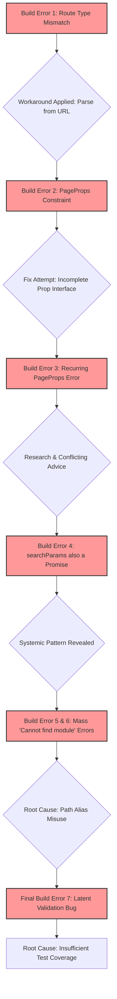
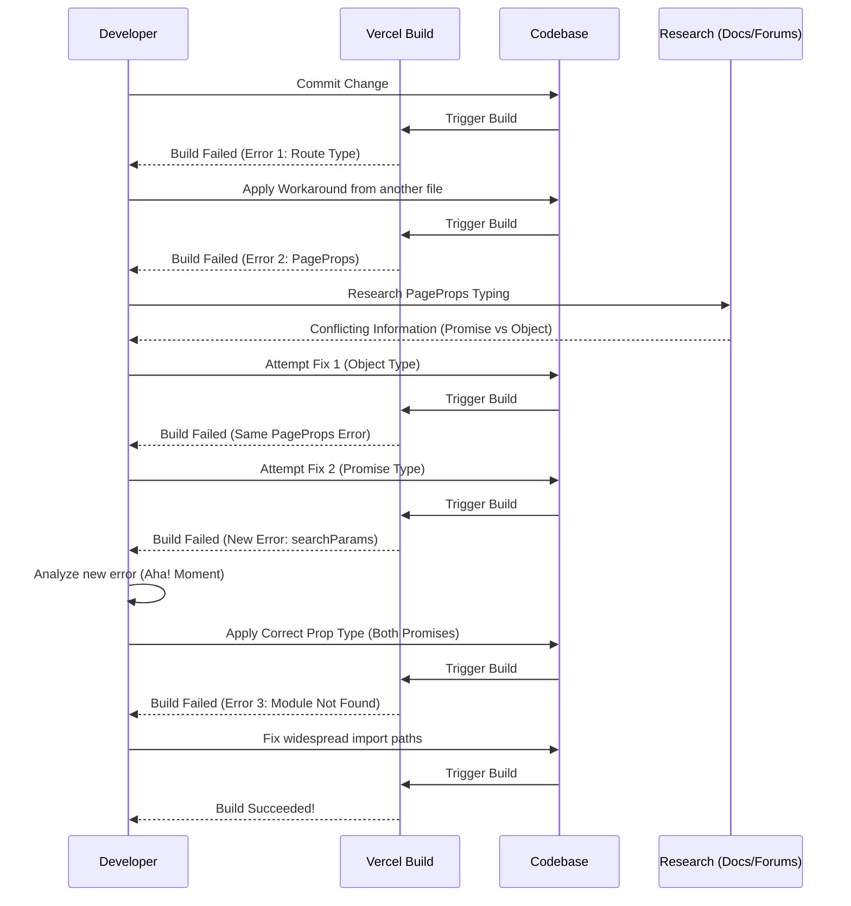

Of course. Here is a comprehensive Markdown document analyzing the build error from the multiple perspectives you requested, including Mermaid diagrams for visualizing technical concepts.

***

# Build Error Postmortem & Analysis

## 1. Introduction

On July 15, 2025, a series of cascading build failures blocked deployments and halted development. The investigation revealed several distinct but related issues, starting with a TypeScript error in a Next.js route handler and culminating in the discovery of widespread incorrect import paths and a latent bug in a data validation function.

This document provides a detailed analysis of the debugging process and its root causes from three critical perspectives: the Software Architect, the Software Developer, and the Product Manager. The goal is to understand not only *what* went wrong but *why*, and to establish clear, actionable steps to prevent similar incidents in the future.

## 2. The Software Architect's Perspective

From an architectural standpoint, this incident was not a single bug but a symptom of several underlying systemic issues related to project structure, configuration, and coding conventions.

### 2.1. Key Architectural Findings

*   **Inconsistent Typing Patterns:** The initial errors highlighted a lack of a standardized, enforced pattern for typing props in Next.js. The first error in `like/route.ts` was sidestepped by adopting a workaround from another file (`comments/route.ts`) instead of addressing the type signature directly. This was followed by a series of failures in `page.tsx` files due to an incorrect understanding of how to type `params` and `searchParams` for `async` Server Components. A robust architecture requires clear, documented conventions for such common patterns to reduce ambiguity and prevent one-off solutions.
*   **Path Alias Misconfiguration and Misuse:** The most disruptive issue was the cascade of "Cannot find module" errors. This was caused by a simple but critical flaw: developers were using an incorrect import path (`@/types/...`) that did not align with the `tsconfig.json` alias (`"@/*": ["./*"]`) and the actual file structure (`lib/types/...`). This points to a failure in both communicating and enforcing architectural decisions. A well-defined project structure is useless if it is not consistently applied.
*   **Latent Business Logic Bugs:** The final error, a type mismatch in a `GeoJSONPoint` validation function, is particularly concerning. This bug was completely hidden until the import path was fixed, meaning it was a latent issue in the codebase. It indicates that our static analysis and testing strategies are not sufficient to catch critical errors in business logic before they reach the build stage, or worse, production.

### 2.2. Architectural Recommendations

1.  **Establish and Enforce a Typing Standard:** Create a central document or internal guide that specifies the correct way to type common Next.js patterns, such as Route Handlers and Page Props (for both `async` and non-`async` components). This standard should be enforced through code review and potentially custom ESLint rules.
2.  **Refine and Enforce Path Aliases:** The `tsconfig.json` path aliases should be reviewed. Using a more specific alias like `@lib/*` for the `lib` directory could prevent this kind of confusion. An ESLint rule should be implemented to disallow relative paths (`../`) that cross major directory boundaries, forcing the use of aliases and improving maintainability.
3.  **Bolster Automated Quality Gates:** We must increase our investment in automated testing. Unit tests should be mandatory for all validation and business logic functions (`/lib/validation`, `/lib/data`). This would have caught the `GeoJSONPoint` bug independently of any build process.

### 2.3. Diagram: The Cascade of Failures

This diagram illustrates how the initial, seemingly isolated type error was actually the entry point to discovering deeper, more systemic architectural issues.



## 3. The Software Developer's Perspective

As the developer on the ground, this incident was a frustrating journey of "whack-a-mole" debugging, where each fix revealed a new, seemingly unrelated problem.

### 3.1. Debugging Journey and Technical Analysis

1.  **Initial API Route Error:** The build failed in `app/api/community/posts/[postId]/like/route.ts` because the type signature for the `POST` function's second argument was incorrect. Instead of diving deep into the Next.js types, I observed that a neighboring `comments/route.ts` file simply parsed the ID from the `req.url`. I applied this simpler pattern, which fixed the immediate error but masked the underlying lack of understanding of the framework's typing.

2.  **The `PageProps` Puzzle:** A new error appeared in `app/community/[postId]/page.tsx`: `Type ... does not satisfy the constraint 'PageProps'`. My first instinct was to create an explicit interface for the props. This was a good step, but the key challenge was determining the *correct* shape of `PageProps`.
    *   **Research Conflict:** Research provided contradictory advice. Official documentation snippets suggested that `params` was a `Promise`, while community forums insisted it was a plain object. The error message `...is missing the following properties from type 'Promise<any>'` was misleading, as it suggested the type system *expected* a Promise.
    *   **The Breakthrough:** After several failed attempts, a new error log finally provided the answer: `Types of property 'searchParams' are incompatible... not assignable to type 'Promise<any> | undefined'`. This revealed that for `async` pages, **both `params` and `searchParams` are Promises**.

3.  **The Correct Prop Type:** The correct interface for an `async` Next.js page with dynamic routes is:
    ```typescript
    interface PageProps {
      params: Promise<{ postId: string }>;
      searchParams?: Promise<{ [key: string]: string | string[] | undefined }>;
    }
    ```

4.  **The Import Path Cascade:** Once the typing for `PageProps` was resolved, a new class of error emerged: `Cannot find module '@/types/...'`. This was a simple pathing error, but it was present in over a dozen files. The fix was to change all instances of `from "@/types/..."` to `from "@/lib/types/..."` to match our project's `tsconfig.json` and file structure.

5.  **The Final Validation Bug:** Fixing the last import path in `lib/validation/property.ts` uncovered a latent bug. The code was attempting to perform a regex match on a `GeoJSONPoint` object:
    *   **Incorrect Code:** `const match = property.location.match(pointRegex);`
    *   **Cause:** `property.location` is an object `{ type: 'Point', coordinates: [lon, lat] }`, not a string.
    *   **Corrected Logic:** The validation was rewritten to check the object's properties directly, eliminating the type error:
        ```typescript
        if (property.location.type !== 'Point' || !Array.isArray(property.location.coordinates) || property.location.coordinates.length !== 2) {
          errors.push('Location must be a valid GeoJSON Point.');
        }
        ```

### 3.2. Diagram: Developer Debugging Flow

This diagram shows the iterative and often frustrating loop a developer can get into when dealing with cascading and misleading errors.



## 4. The Product Manager's Perspective

While the errors were technical, the impact was felt directly in our ability to deliver value and maintain a stable product.

### 4.1. Business & Product Impact

*   **Blocked Deployments & Lost Velocity:** The most immediate impact was a complete halt to all deployments. No new features, bug fixes, or other improvements could be shipped while the build was broken. An entire developer's workday was consumed by this single chain of issues, representing a direct loss of productivity and a delay in our product roadmap.
*   **Increased Risk & Decreased Predictability:** This incident demonstrates how fragile our development pipeline can be. What was likely planned as a small task spiraled into a multi-hour debugging session. This unpredictability makes it difficult to forecast feature delivery timelines and manage stakeholder expectations. The existence of latent bugs, like the one in the validation logic, implies a higher risk profile for our application than previously understood.
*   **The Cost of "Hidden" Problems:** The root causes—unclear coding standards and insufficient test coverage—are forms of technical debt. This incident provides a clear example of that debt coming due. The time spent fixing these issues is time not spent building features that directly benefit our users.

### 4.2. Product & Process Recommendations

1.  **Prioritize Pipeline Stability:** We must treat the health of our build and deployment pipeline as a top-tier feature. I will advocate for allocating development time in our upcoming sprints to address the architectural and testing recommendations outlined above. This is a direct investment in our future ability to ship features quickly and reliably.
2.  **Formalize Technical Debt Repayment:** We should institute a process where a certain percentage of every sprint (e.g., 10-15%) is reserved for addressing technical debt. This allows us to proactively fix issues like the widespread import path errors, rather than reactively when they cause a production-stopping failure.
3.  **Translate Technical Risk into Product Risk:** As a Product Manager, I will work more closely with the engineering lead to understand and communicate technical risks in product terms. A "latent validation bug" is a risk of "corrupting user data" or "showing incorrect information to customers," which helps prioritize fixing it.

### 4.3. Diagram: Impact on Development Timeline

This Gantt chart visualizes how a seemingly simple task was derailed by the cascading build failures, delaying the entire feature development track.

```mermaid
gantt
    title Feature Delivery Timeline
    dateFormat  HH:mm
    axisFormat %H:%M
    section Feature X
    Task 1 (Dev)           :09:00, 2h
    Task 2 (Build & Deploy)  :11:00, 30m
    section Incident Response
    Build Failure 1        :11:00, 30m
    Build Failure 2        :11:30, 1h
    Build Failure 3        :12:30, 2h
    Build Failure 4 (Final) :14:30, 1h
    section Resumed Development
    Task 2 (Build & Deploy)  :15:30, 30m
    Task 3 (QA)              :16:00, 2h
```

