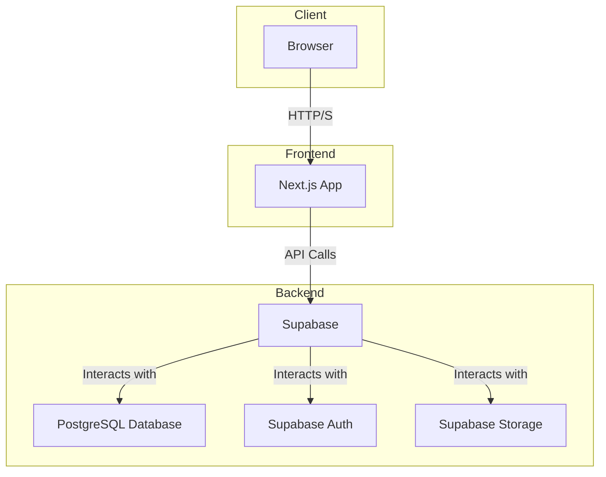
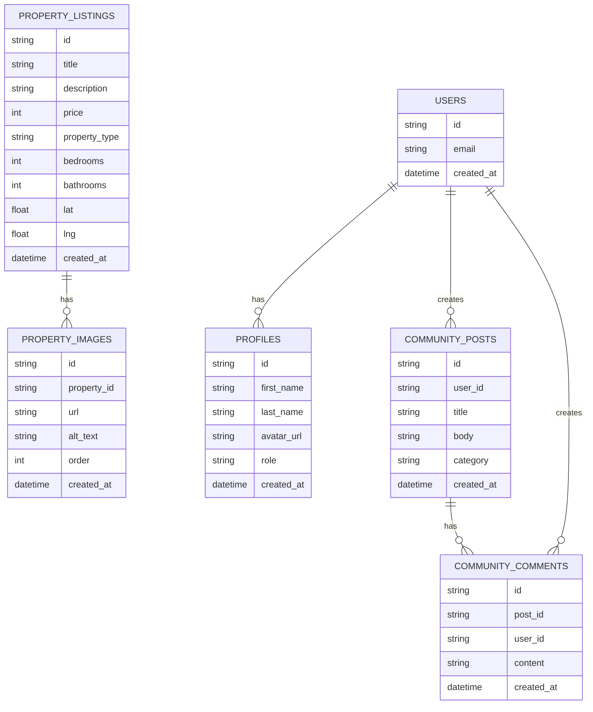

# Codebase Analysis

This document provides a comprehensive analysis of the Vietnamese Real Estate Platform for Korean Expatriates. The analysis is presented from three perspectives: Software Architect, Software Developer, and Product Manager.

## 1. Product Manager's Perspective

### 1.1. Product Overview

A specialized real estate platform targeting Korean expatriates living in Vietnam (Ho Chi Minh City, Hanoi, Da Nang). The platform combines property listings with community features to help Korean residents find housing and connect with each other.

### 1.2. Core Features

- **Property Listings**: Monthly rent (월세) and purchase (매매) properties.
- **Community Forum**: Location-based discussions and local advice.
- **Agent Network**: Verified real estate agent registration and management.
- **Korean Localization**: Korean language interface and culturally relevant features.

### 1.3. Target Audience

- **Primary**: Korean expatriates (professionals, families, students).
- **Secondary**: Real estate agents serving Korean clients.

### 1.4. Business Model

- Agent commissions on property transactions.
- Premium listing features for agents.
- Community-driven engagement to build trust and retention.

## 2. Software Architect's Perspective

### 2.1. System Architecture

The application is a monolithic web application built on a modern technology stack. It leverages a serverless backend provided by Supabase and a frontend built with Next.js.

### 2.2. Technology Stack

- **Frontend**: Next.js 15, React 19, TypeScript, Tailwind CSS, shadcn/ui
- **Backend**: Supabase (PostgreSQL, Auth, Storage)
- **Key Libraries**: Zod, React Hook Form, Lucide React, Resend, Sonner

### 2.3. Data Model

The data model is centered around properties, users, and community interactions. The following Mermaid diagram illustrates the key entities and their relationships.

### 2.4. Authentication and Authorization

Authentication is handled by Supabase Auth, which supports email/password and Google OAuth. Authorization is implemented using Row Level Security (RLS) policies in the PostgreSQL database.

## 3. Software Developer's Perspective

### 3.1. Project Structure

The project is organized into the following directories:

- `app/`: Next.js App Router pages and API routes.
- `components/`: Reusable React components.
- `lib/`: Shared utilities and business logic.
- `supabase/`: Database migrations and configuration.
- `public/`: Static assets.

### 3.2. Development Workflow

1. **Local Development**: Run `npm run dev` to start the Next.js development server.
2. **Database Migrations**: Use the Supabase CLI to manage database schema changes.
3. **Code Quality**: Use ESLint for linting and Prettier for code formatting.
4. **Testing**: (No testing framework configured yet).

### 3.3. Key Code Components

- **`lib/data/property.ts`**: Contains functions for fetching and managing property data.
- **`lib/data/community.ts`**: Contains functions for fetching and managing community data.
- **`lib/supabase/client.ts`**: Initializes the Supabase client for browser-side use.
- **`components/property/PropertyCard.tsx`**: A reusable component for displaying property information.
- **`app/community/[postId]/page.tsx`**: A dynamic page for displaying a single community post and its comments.

### 3.4. Deployment

The application is deployed on a platform that supports Next.js applications (e.g., Vercel, Netlify). The Supabase backend is a managed service, so no server maintenance is required.

## 4. Community Feature Improvements

### 4.1. User Profiles

- **Public Profiles**: Allow users to view each other's profiles, including their posts and comments.
- **Profile Editing**: Enable users to edit their profile information, including their name, avatar, and a short bio.

### 4.2. Notifications

- **In-App Notifications**: Implement a notification system to alert users when someone replies to their posts or comments.
- **Email Notifications**: Allow users to opt-in to receive email notifications for important events.

### 4.3. Gamification

- **User Badges**: Award badges to users for achieving certain milestones (e.g., number of posts, likes received).
- **Leaderboards**: Create leaderboards to recognize the most active and helpful community members.

### 4.4. Content Moderation

- **Reporting**: Allow users to report inappropriate content.
- **Admin Dashboard**: Provide an admin dashboard for moderators to review and take action on reported content.
