# Comprehensive Codebase Analysis: Vietnamese Real Estate Platform

## Executive Summary

This document provides a comprehensive analysis of a Vietnamese real estate platform designed specifically for Korean expatriates. The platform is built using modern web technologies with a focus on scalability, user experience, and community engagement.

### Key Findings
- **Technology Stack**: Next.js 15 with React 19, Supabase backend, TypeScript, Tailwind CSS v4
- **Target Market**: Korean expatriates living in Vietnam (Ho Chi Minh City, Hanoi, Da Nang)
- **Core Features**: Property listings, community forum, agent registration, multilingual support
- **Architecture**: Modern full-stack application with server-side rendering and real-time capabilities

---

## 1. Software Architecture Analysis

### 1.1 High-Level Architecture

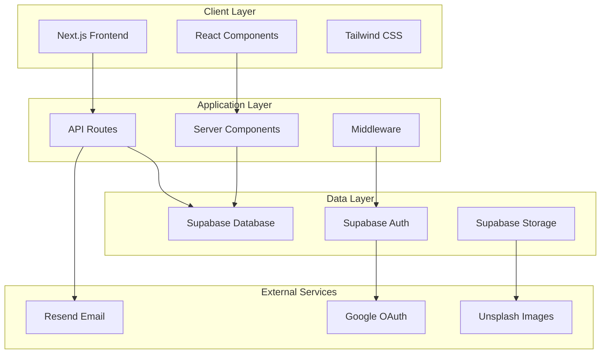

### 1.2 Technology Stack

| Layer | Technology | Version | Purpose |
|-------|------------|---------|---------|
| Frontend | Next.js | 15.3.1 | React framework with SSR/SSG |
| UI Framework | React | 19.0.0 | Component-based UI |
| Styling | Tailwind CSS | 4.1.4 | Utility-first CSS framework |
| Backend | Supabase | Latest | BaaS with PostgreSQL |
| Authentication | Supabase Auth | Latest | OAuth & session management |
| Language | TypeScript | 5.8.3 | Type-safe JavaScript |
| UI Components | shadcn/ui | Latest | Reusable component library |
| Email Service | Resend | 4.5.0 | Transactional emails |

### 1.3 Project Structure

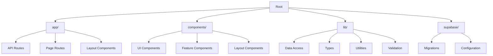

---

## 2. Product Management Analysis

### 2.1 Target Market & User Personas

**Primary Users**: Korean expatriates in Vietnam
- **Demographics**: Working professionals, families, students
- **Locations**: Ho Chi Minh City, Hanoi, Da Nang, Nha Trang, Vung Tau, Hai Phong
- **Needs**: Korean-friendly housing, community connection, local information

**Secondary Users**: Real estate agents
- **Role**: Property listing management, client communication
- **Requirements**: Registration system, property management tools

### 2.2 Core Features & User Journey

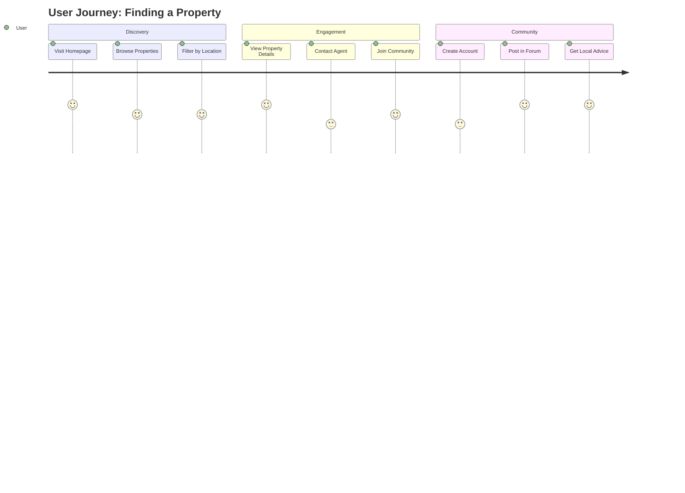

### 2.3 Feature Analysis

| Feature | Status | Priority | User Value |
|---------|--------|----------|------------|
| Property Listings | ✅ Implemented | High | Core functionality |
| Search & Filters | ✅ Implemented | High | Essential UX |
| Community Forum | ✅ Implemented | Medium | User engagement |
| Agent Registration | ✅ Implemented | Medium | Business model |
| Google Authentication | ✅ Implemented | High | User onboarding |
| Korean Localization | ✅ Implemented | High | Target market |
| Mobile Responsive | ✅ Implemented | High | Mobile-first users |

---

## 3. Technical Implementation Analysis

### 3.1 Database Schema

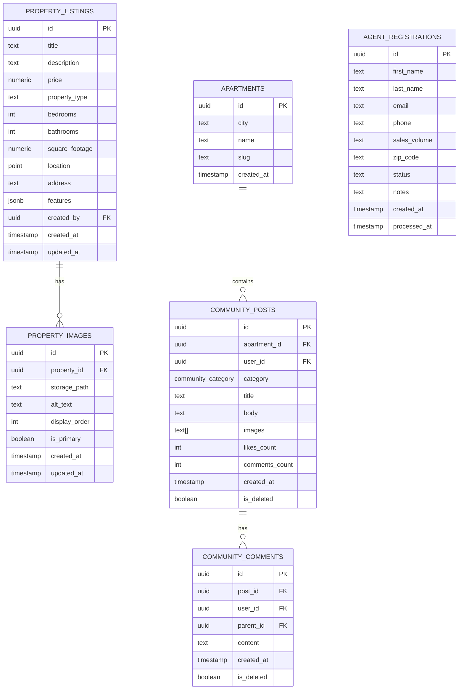

### 3.2 API Architecture

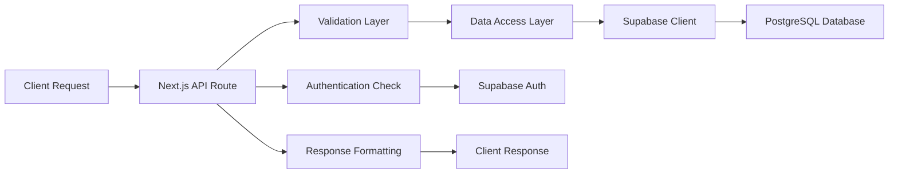

### 3.3 Authentication Flow

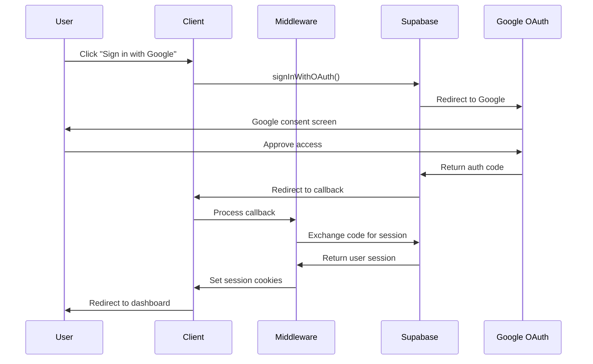

---

## 4. Code Quality Assessment

### 4.1 Strengths

1. **Type Safety**: Comprehensive TypeScript implementation
2. **Modern Architecture**: Next.js 15 with App Router
3. **Component Reusability**: Well-structured component hierarchy
4. **Database Design**: Proper normalization and relationships
5. **Security**: Row-level security policies implemented
6. **Performance**: Server-side rendering and caching strategies

### 4.2 Areas for Improvement

1. **Error Handling**: Inconsistent error handling patterns
2. **Testing**: No test files found in the codebase
3. **Documentation**: Limited inline documentation
4. **Monitoring**: No observability/monitoring setup
5. **Internationalization**: Hardcoded Korean text in components

### 4.3 Technical Debt Analysis

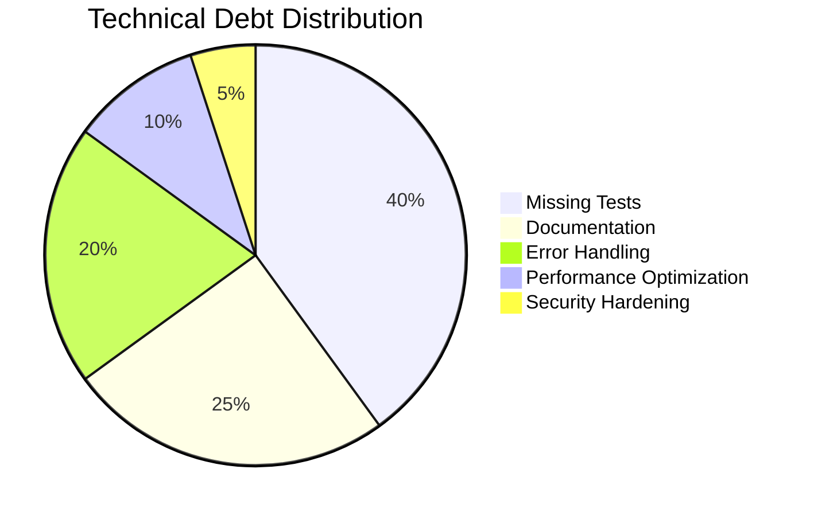

---

## 5. Security Analysis

### 5.1 Security Measures Implemented

1. **Authentication**: Google OAuth integration
2. **Authorization**: Row-level security (RLS) policies
3. **Data Validation**: Zod schema validation
4. **HTTPS**: Enforced in production
5. **Environment Variables**: Sensitive data protection

### 5.2 Security Recommendations

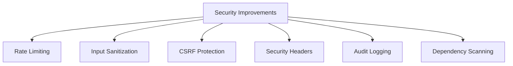

---

## 6. Performance Analysis

### 6.1 Performance Optimizations

1. **Server-Side Rendering**: Next.js SSR for faster initial loads
2. **Image Optimization**: Next.js Image component
3. **Caching**: Unstable_cache for data fetching
4. **Code Splitting**: Automatic with Next.js
5. **Database Indexing**: Proper indexes on frequently queried columns

### 6.2 Performance Metrics & Recommendations

| Metric | Current | Target | Recommendation |
|--------|---------|--------|----------------|
| First Contentful Paint | Unknown | <1.5s | Implement monitoring |
| Largest Contentful Paint | Unknown | <2.5s | Optimize images |
| Time to Interactive | Unknown | <3.5s | Code splitting |
| Cumulative Layout Shift | Unknown | <0.1 | Stable layouts |

---

## 7. Scalability Assessment

### 7.1 Current Scalability Features

1. **Database**: PostgreSQL with proper indexing
2. **CDN**: Supabase Storage for static assets
3. **Caching**: Next.js caching strategies
4. **Serverless**: Vercel deployment ready

### 7.2 Scalability Roadmap

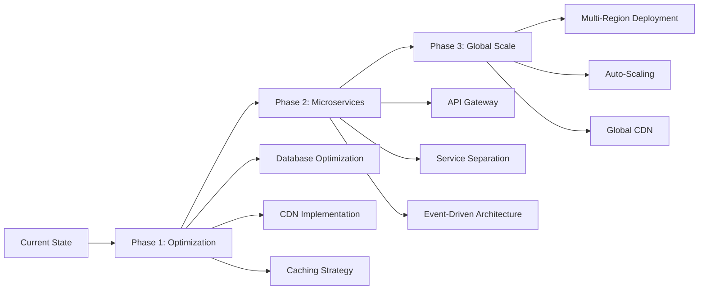

---

## 8. Development Workflow Analysis

### 8.1 Current Development Setup

1. **Package Manager**: npm with package-lock.json
2. **Code Quality**: ESLint configuration
3. **Styling**: Tailwind CSS with PostCSS
4. **Type Checking**: TypeScript strict mode
5. **Build System**: Next.js build pipeline

### 8.2 Recommended Improvements

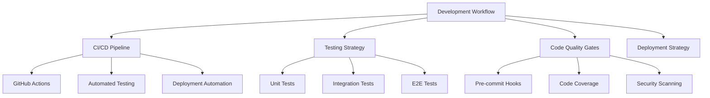

---

## 9. Business Logic Analysis

### 9.1 Core Business Rules

1. **Property Types**: Only "월세" (monthly rent) and "매매" (purchase) - no "전세" (jeonse) as it doesn't exist in Vietnam
2. **User Roles**: Regular users, agents, and admins
3. **Community Moderation**: Self-moderated with like/dislike system
4. **Agent Verification**: Manual approval process for agent registrations

### 9.2 Revenue Model Analysis

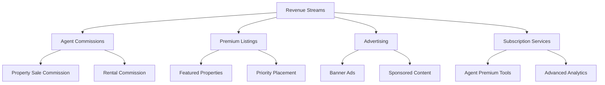

---

## 10. Recommendations & Next Steps

### 10.1 Immediate Actions (0-3 months)

1. **Testing Implementation**
   - Add unit tests for critical business logic
   - Implement integration tests for API routes
   - Set up E2E testing with Playwright

2. **Performance Monitoring**
   - Implement analytics (Google Analytics, Mixpanel)
   - Add performance monitoring (Vercel Analytics)
   - Set up error tracking (Sentry)

3. **Security Hardening**
   - Implement rate limiting
   - Add CSRF protection
   - Security headers configuration

### 10.2 Medium-term Goals (3-6 months)

1. **Feature Enhancements**
   - Advanced search with map integration
   - Real-time chat for property inquiries
   - Mobile app development

2. **Scalability Improvements**
   - Database optimization
   - CDN implementation
   - Caching strategy refinement

3. **Business Development**
   - Agent onboarding automation
   - Payment integration
   - Analytics dashboard for agents

### 10.3 Long-term Vision (6-12 months)

1. **Market Expansion**
   - Support for additional cities
   - Multi-language support (English, Vietnamese)
   - Integration with local services

2. **Advanced Features**
   - AI-powered property recommendations
   - Virtual property tours
   - Blockchain-based property verification

3. **Platform Evolution**
   - Microservices architecture
   - API marketplace
   - Third-party integrations

---

## 11. Risk Assessment

### 11.1 Technical Risks

| Risk | Probability | Impact | Mitigation |
|------|-------------|--------|------------|
| Database Performance | Medium | High | Implement caching, optimize queries |
| Security Vulnerabilities | Low | High | Regular security audits, updates |
| Third-party Dependencies | Medium | Medium | Dependency monitoring, alternatives |
| Scalability Issues | Medium | High | Performance monitoring, optimization |

### 11.2 Business Risks

| Risk | Probability | Impact | Mitigation |
|------|-------------|--------|------------|
| Market Competition | High | Medium | Unique value proposition, community focus |
| Regulatory Changes | Medium | High | Legal compliance monitoring |
| User Acquisition | Medium | High | Marketing strategy, referral programs |
| Agent Retention | Medium | Medium | Value-added services, support |

---

## 12. Conclusion

The Vietnamese real estate platform represents a well-architected, modern web application with strong technical foundations. The focus on Korean expatriates provides a clear market niche with specific user needs. The technology stack is current and scalable, with room for growth and enhancement.

### Key Strengths
- Modern, type-safe architecture
- Clear target market focus
- Comprehensive feature set
- Strong database design
- Security-conscious implementation

### Critical Success Factors
1. **User Experience**: Continued focus on Korean expatriate needs
2. **Community Building**: Foster active community engagement
3. **Agent Network**: Build strong agent relationships
4. **Technical Excellence**: Maintain code quality and performance
5. **Market Adaptation**: Stay responsive to market changes

The platform is well-positioned for growth with the recommended improvements and strategic focus on its unique market position.