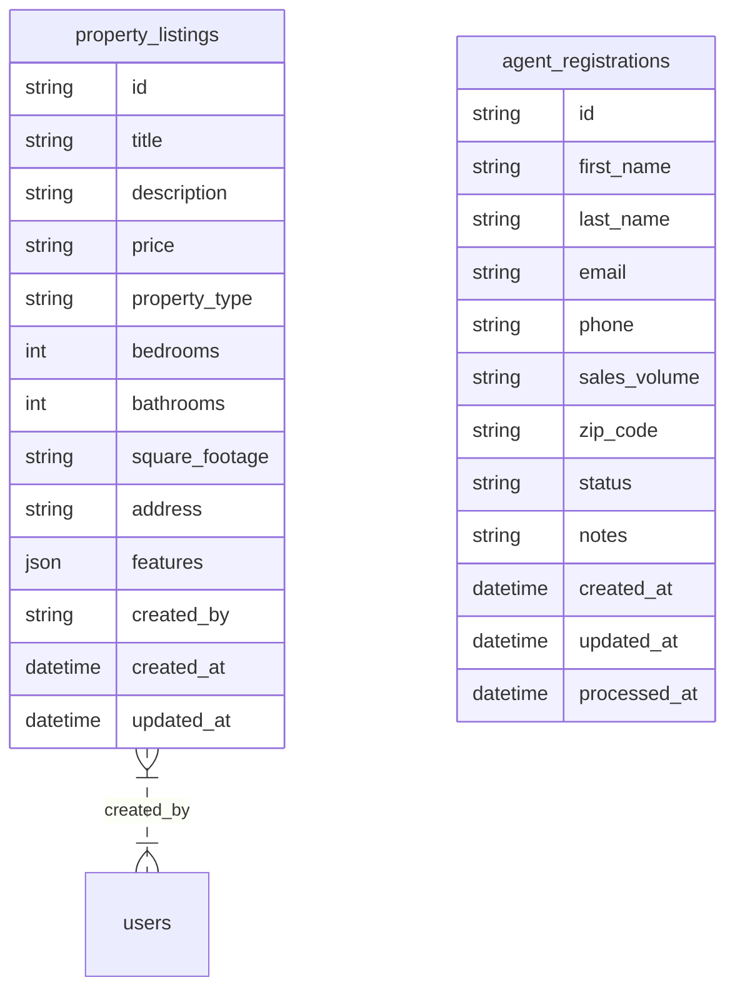

# Project Analysis

This document provides a comprehensive analysis of the platform project from three key perspectives: Software Architect, Software Developer, and Product Manager.

## 1. Software Architect's Perspective

From a software architect's point of view, the project is a well-structured and modern web application built on a solid foundation of popular and effective technologies.

### 1.1. Technology Stack

The technology stack is a modern and robust combination of technologies that are well-suited for building a scalable and maintainable web application.

*   **Framework:** Next.js 15 (React)
*   **Language:** TypeScript
*   **Styling:** Tailwind CSS 4 with shadcn/ui components
*   **Backend:** Next.js API Routes with Supabase (PostgreSQL) for the database
*   **Authentication:** Supabase Auth

### 1.2. Architecture

The application follows a classic client-server architecture, with the Next.js frontend communicating with the Next.js backend via API routes. The backend, in turn, interacts with the Supabase database.

```mermaid
graph TD
    A[Client (Next.js Frontend)] --> B(Next.js API Routes);
    B --> C(Supabase);
    C --> B;
```

### 1.3. Data Model

The data model is centered around two main entities: `property_listings` and `agent_registrations`.



### 1.4. Scalability and Performance

The use of Next.js and Supabase provides a good foundation for scalability. Next.js's server-side rendering and static site generation capabilities can be leveraged to improve performance, while Supabase's managed database and authentication services can handle a growing number of users and data.

### 1.5. Security

The application uses Supabase Auth for authentication, which is a secure and reliable solution. The use of middleware to protect routes ensures that only authenticated users can access sensitive information.

## 2. Software Developer's Perspective

From a software developer's perspective, the project is well-organized and easy to work with. The codebase is clean, consistent, and well-documented.

### 2.1. Codebase Structure

The codebase is organized into a logical and intuitive directory structure.

*   `app/`: Contains the application's pages and API routes.
*   `components/`: Contains reusable React components.
*   `lib/`: Contains shared libraries and utilities, including data access, Supabase clients, and validation schemas.
*   `supabase/`: Contains database migrations.
*   `types/`: Contains TypeScript type definitions.

### 2.2. Development Experience

The development experience is enhanced by the use of modern tools and technologies.

*   **TypeScript:** Provides type safety and improved code quality.
*   **ESLint:** Enforces a consistent coding style.
*   **Next.js:** Offers a fast and efficient development server with hot reloading.
*   **shadcn/ui:** Provides a set of accessible and customizable UI components.

### 2.3. Testing

While there are no dedicated test files in the repository, the project is set up in a way that makes it easy to add unit and integration tests. The clear separation of concerns between the UI, business logic, and data access layers makes it straightforward to test individual components and functions in isolation.

## 3. Product Manager's Perspective

From a product manager's perspective, the project is a promising real estate platform with a clear value proposition.

### 3.1. Core Features

The application provides a solid set of core features for a real estate platform.

*   **Property Listings:** Users can browse, search, and view detailed information about property listings.
*   **Agent Registration:** Real estate agents can register to be listed on the platform.
*   **User Authentication:** Users can create accounts and sign in to access personalized features.
*   **Request Information:** Users can contact agents to request more information about properties.

### 3.2. Target Audience

The target audience for the platform appears to be homebuyers, sellers, and real estate agents in the Korean market, as evidenced by the use of the Korean language in the UI and the "Korean Expatriates" section.

### 3.3. Potential for Growth

The platform has significant potential for growth. Here are some potential new features and improvements that could be considered:

*   **Advanced Search Filters:** Add more advanced search filters, such as price range, number of bedrooms, and property type.
*   **Saved Searches and Favorites:** Allow users to save their searches and mark properties as favorites.
*   **Agent Profiles:** Create detailed profiles for real estate agents, including their listings, sales history, and reviews.
*   **Mortgage Calculator:** Integrate a mortgage calculator to help users estimate their monthly payments.
*   **Map View:** Display property listings on a map to help users visualize their location.

---

# DeepWiki Platform Documentation Summary

# VinaHome Platform – DeepWiki Project Summary

## 1. Platform Overview

VinaHome is a Next.js-based real estate platform serving Korean expatriates in Vietnam. It provides property search, listing management, and agent onboarding with full Korean language and cultural support.

**Key Features:**
- Korean language interface (`Noto_Sans_KR` font)
- Properties near Korean communities, schools, and amenities
- Agent registration with email notifications
- Advanced property search with geo-filtering
- Korean-focused content and UX

**Tech Stack:**
| Technology      | Version   | Purpose                        |
|----------------|-----------|--------------------------------|
| Next.js        | 15.3.1    | React framework, App Router    |
| TypeScript     | 5.8.3     | Type safety                    |
| Tailwind CSS   | 4.1.4     | Styling                        |
| Supabase       | 2.39.8    | DB, Auth, Storage              |
| React          | 19.0.0    | UI library                     |
| Zod            | 3.24.4    | Schema validation              |
| React Hook Form| 7.56.3    | Form management                |
| Resend         | 4.5.0     | Email service                  |
| Sonner         | 2.0.3     | Toast notifications            |

## 2. System Architecture

- **Full-stack Next.js 14+ App Router**
- **Supabase** for backend (PostgreSQL, Auth, Storage)
- **SSR/CSR**: Server and client components, dual Supabase client (server: `lib/supabase/server.ts`, client: `lib/supabase/client.ts`)
- **Authentication Middleware**: Route protection, session validation, cookie management (`middleware.ts`)
- **UI Layer**: shadcn/ui, Radix UI, Tailwind CSS, Sonner for notifications

**Architecture Diagram:**
- UI Component System
- Next.js App Layer
- Supabase Integration Layer
- External Services (Resend, CDN)

## 3. User Authentication System

- **Supabase Auth**: Email-based registration, verification, sign-in, session management
- **Middleware**: Protects routes, validates sessions, redirects unauthenticated users
- **Session Management**: Cookie-based, SSR/CSR split
- **Email Verification**: Token-based, handled via `/auth/confirm` route
- **Password Reset**: Self-service via email, `/auth/forgot-password` and `/auth/update-password`
- **Protected Routes**: `/admin/*`, `/profile/*`, `/saved-homes` require authentication

**Key Code Patterns:**
```ts
// Server-side Supabase client
export async function createClient() {
  const cookieStore = await cookies();
  return createServerClient(
    process.env.NEXT_PUBLIC_SUPABASE_URL!,
    process.env.NEXT_PUBLIC_SUPABASE_ANON_KEY!,
    { cookies: { get, set } }
  );
}
```

## 4. Agent Registration System

- **Multi-step registration** for real estate agents
- **Korean-language UI** and contextual onboarding
- **Form validation**: Zod schemas, both client and server
- **API endpoint**: `/api/agents/register` handles validation, DB insert, and email notification
- **Email notifications**: Resend service, React email templates, non-blocking delivery
- **Success page**: Clear next steps, timeline, and navigation

**Validation Schema Example:**
```ts
agentRegistrationSchema = z.object({
  firstName: z.string().min(2),
  lastName: z.string().min(1),
  email: z.string().email(),
  phone: z.string().min(10),
  salesVolume: z.string().nonempty(),
  zipCode: z.string().min(5),
});
```

## 5. Property Management System

- **Layered architecture**: Data, business logic, API, presentation
- **Property search**: Multi-criteria filtering (price, type, location, amenities)
- **Geographical search**: PostGIS for geo-filtering
- **Data access**: Cached server functions, public API endpoints
- **Image management**: Supabase Storage, DB records, public URLs
- **API**: `/api/properties` for search, filtering, and pagination
- **Database schema**: `property_listings`, `property_images`, features as JSONB
- **Caching**: Next.js `unstable_cache` for listings and details

**Property Features Example:**
```ts
interface PropertyFeatures {
  parking?: boolean;
  airConditioning?: boolean;
  elevator?: boolean;
  pool?: boolean;
  gym?: boolean;
  furnished?: boolean;
  koreanCommunity?: boolean;
  koreanRestaurants?: boolean;
  internationalSchool?: boolean;
  koreanSchool?: boolean;
  koreanSupermarket?: boolean;
}
```

## 6. User Interface Components

- **Component system**: shadcn/ui, Radix UI, Tailwind CSS
- **Layout**: Header, Footer, StagewiseToolbarLoader (dev only), Sonner Toaster
- **Korean Expatriates Section**: Targeted content for Korean users
- **Search and Listing**: Responsive grid, filter sidebar, paginated results
- **PropertyCard**: Consistent display of property info, price formatting, distance calculation
- **Featured Properties**: Carousel and tab-based display for rent/buy

## 7. Placeholders for Unavailable Sections

Some documentation sections could not be scraped due to rate limits (HTTP 429). Please refer to DeepWiki for:
- Property Detail Pages
- Property Data Layer & API
- User Interface Components (full details)
- Layout Components
- Section Components & Content Areas

---

**Sources:**
- [DeepWiki VinaHome Platform Overview](https://deepwiki.com/bk202042/platform/1-vinahome-platform-overview)
- [System Architecture](https://deepwiki.com/bk202042/platform/2-system-architecture)
- [User Authentication System](https://deepwiki.com/bk202042/platform/3-user-authentication-system)
- [Authentication Flow & Components](https://deepwiki.com/bk202042/platform/3.1-authentication-flow-and-components)
- [Authentication Middleware & Session Management](https://deepwiki.com/bk202042/platform/3.2-authentication-middleware-and-session-management)
- [Agent Registration System](https://deepwiki.com/bk202042/platform/4-agent-registration-system)
- [Agent Registration Pages & Layout](https://deepwiki.com/bk202042/platform/4.1-agent-registration-pages-and-layout)
- [Property Management System](https://deepwiki.com/bk202042/platform/5-property-management-system)
- [Property Search & Filtering](https://deepwiki.com/bk202042/platform/5.1-property-search-and-filtering)
- [Property Listings & Home Page](https://deepwiki.com/bk202042/platform/5.2-property-listings-and-home-page)

For full details and updates, visit the [DeepWiki project](https://deepwiki.com/bk202042/platform/1-vinahome-platform-overview).
